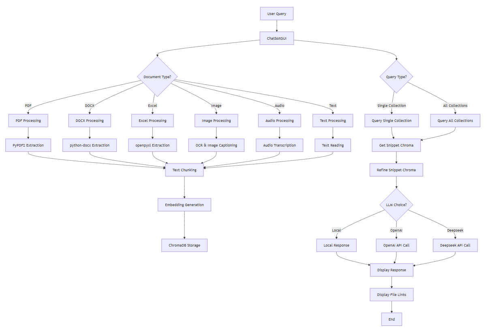

## Overview
My inspiration for this project was learning about the power of technology to help many families searching for their missing relatives. The system uses natural language processing and machine learning techniques to interact with users to process various types of documents that can be used to find missing people. The system is capable of handling PDFs, Word documents, Excel spreadsheets, photos, audios, and plain text files to create a more comprehensive search.

## System Architecture
The system is composed of several interconnected modules, each responsible for a specific functionality. The modular architecture allows for easy maintenance, scalability, and extensibility of the system.

### Processing Flow
1. The user initiates a query through the graphical interface (ChatbotGUI).
2. The system identifies the type of document or query.
3. The document is processed by the specific module (PDF, DOCX, Excel, photos, etc.).
4. The extracted text is divided into chunks and converted into embeddings.
5. Embeddings are stored in ChromaDB for efficient retrieval.
6. The user's query is processed and compared with the stored documents.
7. Relevant snippets are retrieved and refined.
8. An answer is generated using the chosen language model (Local, OpenAI, or Deepseek).
9. The answer is displayed to the user, along with links to the relevant documents. 
10. The image search module on the website https://www.desaparecidos.pr.gov.br/desaparecidos/ was successfully implemented.


## Project Structure
```
Missing_Project/
│
├── main.py # Main entry point
├── chatbot_gui.py # Chatbot graphical interface
├── document_processor.py # Document processing coordinator
├── embedding_utils.py # Embedding generation
├── chroma_utils.py # Interaction with ChromaDB
├── llm_utils.py # Integration with language models
├── audio_utils.py # Audio processing
├── image_utils.py # Image processing
├── pdf_utils.py # PDF processing
├── excel_utils.py # Excel spreadsheet processing
├── docx_utils.py # Word document processing
└── text_utils.py # Text file processing
```

## Module Details

### main.py
- Configures global logging for event tracking.
- Defines essential directories for data storage.
- Initializes the chatbot's graphical interface.
- Handles critical exceptions during initialization.

### chatbot_gui.py
- Implements the graphical interface using Tkinter.
- Manages user interaction, including client and collection selection.
- Coordinates the processing of documents and queries.
- Displays responses and links to relevant documents.

### document_processor.py
- Acts as a central hub for document processing.
- Identifies the document type and directs it to the appropriate processing module.
- Coordinates the generation of embeddings and storage in ChromaDB.

### embedding_utils.py
- Uses the SentenceTransformer model to generate text embeddings.
- Provides functions for individual and batch encoding of text.
- Includes utilities for reloading and testing the embedding model.

### chroma_utils.py
- Manages interaction with the ChromaDB vector database.
- Implements functions for retrieving and refining relevant snippets.
- Handles sanitization of collection names for compatibility with ChromaDB.

### llm_utils.py
- Manages integration with language models (LLMs) such as OpenAI GPT and Deepseek.
- Provides functions for model initialization, response generation, and API key validation.

### Specific Processing Modules
- **audio_utils.py**: Audio transcription and metadata extraction.
- **image_utils.py**: OCR, photo description generation, and metadata extraction.
- **pdf_utils.py**: Text and metadata extraction from PDFs.
- **excel_utils.py**: Excel spreadsheet processing and data extraction.
- **docx_utils.py**: Text, image, and metadata extraction from Word documents.
- **text_utils.py**: Plain text file processing and basic parsing.

## Core Technologies
- **Python**: Core programming language.
- **Tkinter**: For the graphical user interface.
- **SentenceTransformer**: Text embedding generation.
- **ChromaDB**: Vector database for efficient embedding storage.
- **OpenAI GPT / Deepseek**: Language models for advanced response generation.
- **PyPDF2, python-docx, openpyxl**: Libraries for document processing.
- **Azure AI Vision**: Image processing and OCR.
- **Azure AI Speech Service**: Audio processing and transcription.

## Technical Considerations
- The system uses extensive logging to facilitate debugging and monitoring.
- The modular architecture allows for easy addition of new document types or functionalities.
- The use of ChromaDB allows for efficient semantic search on large volumes of documents.
- Integration with multiple LLMs provides flexibility in generating responses.

## Future Improvements
- Implementation of asynchronous processing for better performance with large volumes of documents.
- Addition of support for more file formats and data sources.
- Implementation of fine-tuning of LLM models for specific domains.
- Development of a RESTful API for integration with other systems.
- We are mapping the main missing persons websites to implement throughout Brazil